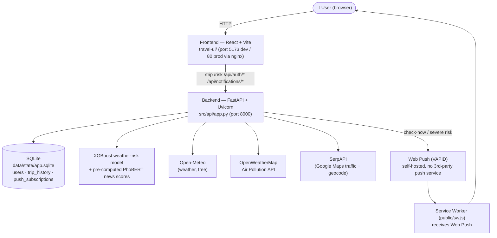

# Vietnam Travel Risk AI — Full Documentation

[](https://github.com/YOUR-USERNAME/YOUR-REPO/actions/workflows/ci.yml)

> **Lean-Agile Workshop — Final Project Submission**
>
> An end-to-end AI-powered travel risk assessment system for Vietnam, combining real-time weather prediction (XGBoost), NLP-based news risk analysis (PhoBERT), live traffic data (SerpAPI + Google Maps), user accounts with trip history, severe-weather Web Push alerts, and an interactive map dashboard (React + Leaflet).
>
> *(Badge above becomes live once this repo is pushed to GitHub — replace `YOUR-USERNAME/YOUR-REPO` with the actual path.)*

---

## Table of Contents

1. [Project Overview](#1-project-overview)
2. [System Architecture](#2-system-architecture)
3. [Prerequisites](#3-prerequisites)
4. [Quick Start (Docker)](#4-quick-start-docker)
5. [Manual Dev Setup — Step by Step](#5-manual-dev-setup--step-by-step)
6. [Environment Variables](#6-environment-variables)
7. [Running the Application](#7-running-the-application)
8. [Verifying the System Works](#8-verifying-the-system-works)
9. [API Reference](#9-api-reference)
10. [Data Pipeline Documentation](#10-data-pipeline-documentation)
11. [AI / ML Model Documentation](#11-ai--ml-model-documentation)
12. [Frontend Documentation](#12-frontend-documentation)
13. [Caching Architecture](#13-caching-architecture)
14. [Testing & CI](#14-testing--ci)
15. [Deployment](#15-deployment)
16. [Project Structure](#16-project-structure)
17. [Design Decisions & Logs](#17-design-decisions--logs)
18. [Known Issues & Future Work](#18-known-issues--future-work)
19. [Troubleshooting](#19-troubleshooting)
20. [Screenshots](#20-screenshots)

---

## 1. Project Overview

### What it does

This system helps travelers in Vietnam assess travel risk by combining **three independent data sources**:

| Source | Method | What it tells you |
|--------|--------|-------------------|
| **Weather AI** | XGBoost model + Safety Gates on real-time Open-Meteo data, real PM2.5 from OpenWeatherMap | Is the weather dangerous for travel? (rain, wind, visibility, UV, air quality) |
| **News Risk** | PhoBERT NLP + keyword rules on Vietnamese news articles | Are there recent safety incidents at this destination? |
| **Traffic** | SerpAPI Google Maps Directions (real-time) | Is the route congested? How long will the drive take? |

These three signals are combined into a single **recommendation**: ✅ **GO** / ⚠️ **CAUTION** / ❌ **DON'T GO**.

### Key Features

- **One-click trip check** — Single `/trip` API call returns traffic + weather AI + news risk + recommendation
- **7-day weather forecast** — AI predicts risk for each day, highlights best/worst travel days
- **Trip purpose adjustment** — Risk scores adapt based on trip type (dating, family, adventure, solo)
- **Interactive map** — 63 province markers, route polyline, risk heatmap, weather popup
- **Multi-city comparison** — Compare weather risk across up to 10 cities simultaneously
- **Province risk trends** — Historical risk trends from news article analysis
- **7-layer in-memory caching** — Minimizes external API calls, sub-second responses after first load
- **Accounts & trip history** — Email/password JWT auth (SQLite-backed); every trip check while logged in is saved and browsable
- **Real air quality** — PM2.5 pulled live from OpenWeatherMap's Air Pollution API instead of a fixed placeholder
- **Severe-weather push alerts** — Self-hosted Web Push (VAPID) notifies you when a watched destination's risk turns severe
- **One-command local run** — `docker compose up --build` starts backend + frontend together
- **CI on every push** — GitHub Actions runs the full pytest suite + frontend build

---

## 2. System Architecture



| Layer | Tech | Notes |
|-------|------|-------|
| Frontend | React 19 + Vite 7 + Leaflet | Dev: Vite proxy → :8000. Prod (Docker): nginx reverse-proxies the same paths to the `backend` service. |
| Backend | FastAPI + Uvicorn | `src/api/app.py` — endpoints only; logic in `config.py`, `utils.py`, `routes.py`, `weather_ai.py`, `auth.py`, `db.py`, `notifications.py`. |
| Auth | PyJWT + bcrypt | Email/password, no OAuth/external identity provider. |
| Storage | SQLite (raw `sqlite3`, no ORM) | `data/state/app.sqlite` — users, trip_history, push_subscriptions. |
| ML | XGBoost (weather) + PhoBERT (news, pre-computed offline) | See [§11](#11-ai--ml-model-documentation) for real eval metrics. |
| External APIs | Open-Meteo (free), OpenWeatherMap Air Pollution, SerpAPI, TrackAsia/OSRM | All keys read from `.env` — see [§6](#6-environment-variables). |
| Push | pywebpush + browser Service Worker | Self-hosted VAPID keypair, no external push provider account. |

---

## 3. Prerequisites

| Requirement | Version | Notes |
|-------------|---------|-------|
| **Python** | 3.11.x | Tested on 3.11.0. Other 3.11.x versions should work. |
| **Node.js** | >= 18 | For the React frontend. Tested with Node 18/20. |
| **npm** | >= 9 | Comes with Node.js. |
| **OS** | Windows 10/11 | All commands below are PowerShell. macOS/Linux users: substitute `.\venv\Scripts\Activate.ps1` with `source venv/bin/activate`. |
| **Git** | Any | To clone the repository (if applicable). |
| **VS Code** | Recommended | With Python and ESLint extensions. |
| **SerpAPI Key** | Required for `/trip` | Free tier: 100 searches/month at [serpapi.com](https://serpapi.com). Without it, trip check and traffic endpoints will fail. |

### Hardware

- **RAM**: Minimum 4 GB free (model loading + DataFrame)
- **Disk**: ~500 MB for dependencies + model files
- **GPU**: Not required (XGBoost runs on CPU; PhoBERT training benefits from GPU but inference is pre-computed)

---

## 4. Quick Start (Docker)

The fastest way to run the full stack (backend + frontend) locally:

```powershell
# 1. Copy the env template and fill in at least SERPAPI_KEYS (see §6)
Copy-Item .env.example .env

# 2. Build and start both services
docker compose up --build
```

- Backend: http://localhost:8000 (health check: http://localhost:8000/health)
- Frontend: http://localhost:5173

`docker-compose.yml` mounts `./data` into the backend container so the SQLite database and pre-processed features persist across restarts. `Dockerfile` builds the API (Python 3.11-slim), `travel-ui/Dockerfile` builds the frontend (Node 20 → nginx, which reverse-proxies API paths to the backend container — see `travel-ui/nginx.conf`).

Requires [Docker Desktop](https://www.docker.com/products/docker-desktop/) running. For local development without Docker (hot reload, debugging), use the manual setup below.

---

## 5. Manual Dev Setup — Step by Step

> **Goal**: From a fresh zip/clone to a fully running system in ~5 minutes.

### Step 1: Extract and Open in VS Code

```powershell
# If you received a zip file:
Expand-Archive -Path .\travel_risk_pipeline_skeleton.zip -DestinationPath .\project
cd .\project\travel_risk_pipeline_skeleton

# Open in VS Code
code .
```

### Step 2: Verify Critical Files Exist

Run these checks in the VS Code terminal (**Terminal → New Terminal**, or ``Ctrl+` ``):

```powershell
# These files MUST exist for the system to work:
Test-Path .\requirements.txt                                          # Python deps
Test-Path .\travel-ui\package.json                                    # Frontend deps
Test-Path .\src\integrations\weather\weather_risk_v4_master.pkl       # AI model
Test-Path .\src\integrations\weather\model_features.json              # Model feature names
Test-Path .\data\features\articles_features.jsonl                     # Pre-processed news data
Test-Path .\configs\provinces.yaml                                    # 63 provinces + coords
```

All should return `True`. If the model file (`.pkl`) or features data (`.jsonl`) is missing, download them from the shared drive link (if provided separately) and place them at the exact paths shown above.

### Step 3: Create Python Virtual Environment

```powershell
# From the project root directory
python -m venv venv
.\venv\Scripts\Activate.ps1
```

You should see `(venv)` prefix in your terminal prompt.

> **Note**: If `Activate.ps1` fails with an execution policy error, run this first:
> ```powershell
> Set-ExecutionPolicy -ExecutionPolicy RemoteSigned -Scope CurrentUser
> ```

### Step 4: Install Python Dependencies

```powershell
pip install -r requirements.txt
```

This installs: FastAPI, uvicorn, pandas, numpy, scikit-learn, xgboost, joblib, PyYAML, requests, torch, transformers, and other dependencies. Full install takes ~2–5 minutes depending on internet speed.

**Verify installation**:
```powershell
python -c "import fastapi; import xgboost; import pandas; import joblib; print('All core packages OK')"
```

### Step 5: Configure SerpAPI Key

Open `src/integrations/traffic/config.py` and replace the key(s) in the `SERPAPI_KEY` list with your own:

```python
SERPAPI_KEY = [
    "your_serpapi_key_here",
]
```

Get a free key at [serpapi.com](https://serpapi.com) (100 searches/month on free tier).

> **Without a SerpAPI key**: The `/trip` and `/traffic/route` endpoints will fail with an error. All other endpoints (weather AI, risk, map, forecast) will work normally without any API key.

### Step 6: Install Frontend Dependencies

```powershell
cd travel-ui
npm install
cd ..
```

### Step 7: Final Verification

```powershell
# Check model loads correctly
python -c "import joblib; m = joblib.load('src/integrations/weather/weather_risk_v4_master.pkl'); print('Model loaded OK, type:', type(m))"

# Check features data exists and has content
python -c "lines = open('data/features/articles_features.jsonl', encoding='utf-8').readlines(); print(f'Features file: {len(lines)} articles loaded')"
```

Both commands should succeed without errors.

---

## 6. Environment Variables

All secrets/config are read from a `.env` file at the repo root (loaded via `python-dotenv` in `src/api/config.py`). Copy `.env.example` → `.env` and fill in what you need — every value has a safe fallback so the app still boots without any of them (some features just stay disabled/degraded).

| Variable | Required for | Where to get it | Fallback if unset |
|----------|--------------|------------------|--------------------|
| `SERPAPI_KEYS` | `/trip`, `/traffic/route` (real traffic + geocoding) | Free tier at [serpapi.com](https://serpapi.com) (100 searches/month) | Requests fail with a clear error; weather/risk endpoints still work |
| `TRACKASIA_KEY` | Route polyline fallback | Optional — a working default is baked in for demo use | Falls back to OSRM |
| `JWT_SECRET` | Auth token signing | Any long random string you generate | Insecure dev default — **must** be changed before deploying publicly |
| `JWT_EXPIRE_MINUTES` | Auth token lifetime | — | `1440` (24h) |
| `OPENWEATHERMAP_API_KEY` | Real PM2.5 in weather risk scoring | Free tier at [openweathermap.org/api/air-pollution](https://openweathermap.org/api/air-pollution) | Falls back to a fixed placeholder value (10.0) |
| `VAPID_PUBLIC_KEY` / `VAPID_PRIVATE_KEY` | Web Push severe-weather alerts | Run `python scripts/generate_vapid_keys.py` and paste the output | Push endpoints return 503 (feature disabled) |
| `VAPID_CONTACT_EMAIL` | Web Push (VAPID claim) | Any `mailto:` address | `mailto:admin@example.com` |

For tests, `DB_PATH_OVERRIDE` lets the test suite point the SQLite database at a throwaway temp file (`tests/conftest.py` sets this automatically — you shouldn't need to touch it).

---

## 7. Running the Application

You need **two terminals** running simultaneously: one for the backend, one for the frontend.

### Terminal 1 — Backend (FastAPI)

```powershell
# From project root
.\venv\Scripts\Activate.ps1
uvicorn src.api.app:app --reload --port 8000
```

**Expected startup output**:
```
[Weather AI] Loaded 15 feature names: ['location_encoded', 'temperature', ...]
[Weather AI] Model loaded successfully.
[Startup] Features DataFrame pre-loaded: XXXX rows
INFO:     Uvicorn running on http://127.0.0.1:8000
```

Quick check: open http://127.0.0.1:8000/health in your browser → should return `{"ok": true}`.

### Terminal 2 — Frontend (Vite)

```powershell
cd travel-ui
npm run dev
```

**Expected output**:
```
VITE vX.X.X  ready in XXXms

➜  Local:   http://localhost:5173/
```

Open **http://localhost:5173** in your browser to see the application.

### Summary

| Component | Command | URL |
|-----------|---------|-----|
| Backend | `uvicorn src.api.app:app --reload --port 8000` | http://127.0.0.1:8000 |
| Frontend | `cd travel-ui && npm run dev` | http://localhost:5173 |

---

## 8. Verifying the System Works

After both servers are running, perform these verification steps to confirm full reproducibility.

### 6.1 Backend Health Check

```powershell
Invoke-RestMethod http://127.0.0.1:8000/health
# Expected: @{ok=True}
```

### 6.2 Debug — Verify Paths and Config

```powershell
Invoke-RestMethod http://127.0.0.1:8000/debug/where
# Verify: features_exists=True, provinces_exists=True
```

### 6.3 Debug — Verify Data is Loaded

```powershell
Invoke-RestMethod http://127.0.0.1:8000/debug/stats
# Expected: rows > 0, columns list, province_top showing Vietnamese provinces
```

### 6.4 Weather AI — Offline Predict (no internet needed)

```powershell
$body = '{"province":"Đà Nẵng","temperature":28,"humidity":85,"precipitation":50,"wind":30,"pm25":15,"visibility_km":5,"uv_index":7}'
Invoke-RestMethod -Method Post -Uri http://127.0.0.1:8000/weather/ai -ContentType 'application/json' -Body $body
# Expected: risk_level, risk_score, message, detection_method="AI_XGBOOST"
```

### 6.5 Weather AI — Live Weather (Open-Meteo, free, no key)

```powershell
$body = '{"city":"Hanoi"}'
Invoke-RestMethod -Method Post -Uri http://127.0.0.1:8000/weather/ai/live -ContentType 'application/json' -Body $body
# Expected: city_resolved, coordinates, risk_level, risk_score, weather_provider="Open-Meteo"
```

### 6.6 Province Risk from News

```powershell
Invoke-RestMethod "http://127.0.0.1:8000/risk?place=%C4%90%C3%A0%20N%E1%BA%B5ng"
# Expected: overall_risk_score (0-10), num_articles, risk_assessment breakdown
```

### 6.7 Seven-Day Forecast

```powershell
Invoke-RestMethod "http://127.0.0.1:8000/weather/ai/forecast?city=Da+Nang&days=7"
# Expected: daily array with 7 entries, each with date, risk_level, risk_score, temperature
```

### 6.8 Trip Check (requires SerpAPI key)

```powershell
Invoke-RestMethod "http://127.0.0.1:8000/trip?destination=Da+Lat&lat=10.77&lon=106.69"
# Expected: from, to, traffic, risk, weather, recommendation, matched_province
```

### 6.9 Frontend Walkthrough

1. Open **http://localhost:5173** in Chrome/Edge
2. Click **"📡 Lấy GPS"** → Allow browser location access
3. Type **"Đà Lạt"** in the Destination field
4. Click **"Check Trip"** → Observe:
   - Route drawn on map (blue polyline)
   - Weather popup appears on map (top-right, glass card)
   - Trip results appear in left panel (traffic status, distance, recommendation)
   - 7-day forecast strip loads below the input
5. Click any **blue province marker** on the map → Bottom panel slides up with risk breakdown + trend chart
6. If trip destination matches a province, a **"🔍 Rủi ro tại [province]"** button appears next to the trip purpose badge → Click it to view that province's risk panel

### 6.10 Automated Test Script

```powershell
.\venv\Scripts\Activate.ps1
python scripts/test_openmeteo_weather.py
```

This script runs 5 automated tests against the running backend: health check, offline predict, live weather, multi-city live, and forecast.

---

## 9. API Reference

### Core Endpoints

| Method | Path | Description | External API |
|--------|------|-------------|--------------|
| `GET` | `/health` | Health check | None |
| `GET` | `/risk?place={province}` | Risk score for one province (from news) | None |
| `GET` | `/risk/compare?places={csv}` | Compare risk for multiple provinces (max 20) | None |
| `GET` | `/risk/trend?place={province}` | Risk trend over time | None |
| `GET` | `/trip?destination={name}&lat={lat}&lon={lon}&trip_purpose={purpose}` | **Full trip check** — traffic + weather + risk + recommendation | SerpAPI |
| `GET` | `/traffic/route?from_addr={a}&to_addr={b}` | Traffic between two addresses | SerpAPI |
| `GET` | `/map/points` | Province list with coordinates (for map markers) | None |
| `GET` | `/map/heat` | Heatmap data (risk intensity per province) | None |

### Auth & Trip History Endpoints

| Method | Path | Description | Auth |
|--------|------|-------------|------|
| `POST` | `/api/auth/register` | Register with email/password, auto-login | None |
| `POST` | `/api/auth/login` | Login, returns JWT | None |
| `GET` | `/api/auth/me` | Current user info | Bearer token |
| `GET` | `/api/trip-history?limit=20&offset=0` | List the logged-in user's saved trips | Bearer token |
| `DELETE` | `/api/trip-history/{id}` | Delete one saved trip | Bearer token |

`GET /trip` also accepts an optional `Authorization: Bearer <token>` header — when present, the result is automatically saved to that user's trip history.

### Web Push Notification Endpoints

| Method | Path | Description | Auth |
|--------|------|-------------|------|
| `GET` | `/api/notifications/vapid-public-key` | Public VAPID key for `PushManager.subscribe` | None |
| `POST` | `/api/notifications/subscribe` | Register a push subscription for a watched destination | Bearer token |
| `POST` | `/api/notifications/unsubscribe` | Remove a push subscription | Bearer token |
| `POST` | `/api/notifications/check-now` | Re-assess risk for watched destinations, push if severe (`risk_score >= 7`) | Bearer token |

### Weather AI Endpoints

| Method | Path | Description | External API |
|--------|------|-------------|--------------|
| `POST` | `/weather/ai` | Predict from manual weather payload (offline) | None |
| `POST` | `/weather/ai/live` | Predict from city name (live weather) | Open-Meteo (free) |
| `GET` | `/weather/ai/forecast?city={name}&days=7` | 7-day forecast with AI risk per day | Open-Meteo (free) |
| `POST` | `/weather/ai/batch` | Batch predict for multiple cities (max 10) | Open-Meteo (free) |

### Debug / Cache Endpoints

| Method | Path | Description |
|--------|------|-------------|
| `GET` | `/debug/where` | Check paths, config, file existence |
| `GET` | `/debug/sample?n=5` | Sample raw features data |
| `GET` | `/debug/stats?reload=true` | DataFrame statistics |
| `GET` | `/debug/caches` | Overview of all 7 caches |
| `GET` | `/debug/trip-cache?clear=true` | View/clear trip cache |
| `GET` | `/debug/weather-cache?clear=true` | View/clear weather + geocode + forecast caches |

> **Interactive docs**: FastAPI auto-generates a full interactive API explorer at [`/docs`](http://127.0.0.1:8000/docs) (Swagger UI) and [`/redoc`](http://127.0.0.1:8000/redoc) — useful for trying requests without curl/Postman.

### Example: `/trip` Response

```json
{
  "from": { "lat": 10.77, "lon": 106.69 },
  "to": {
    "query": "Đà Lạt",
    "name": "Đà Lạt, Lâm Đồng",
    "lat": 11.94,
    "lon": 108.44,
    "province_inferred": "Lâm Đồng"
  },
  "traffic": {
    "status": "light",
    "status_emoji": "🟢",
    "distance_km": 310,
    "time_normal_min": 360,
    "time_traffic_min": 390,
    "time_normal_human": "6h 0m",
    "time_traffic_human": "6h 30m",
    "speed_kmh": 47.7,
    "traffic_score": 2,
    "route_polyline": "...",
    "route_polyline_type": "polyline"
  },
  "risk": {
    "risk_score": 3,
    "num_articles": 12,
    "risk_assessment": {
      "Pricing_Issue": 2,
      "Environmental_Cleanliness": 1,
      "Safety_Security": 5,
      "Natural_Disaster": 3,
      "Fire_Accident_Risk": 1
    }
  },
  "weather": {
    "risk_level": 1,
    "risk_score": 3.45,
    "message": "Rủi ro thấp - Có thể có mưa nhỏ.",
    "detection_method": "AI_XGBOOST",
    "temperature": 22.5,
    "humidity": 78.0,
    "precipitation": 1.2,
    "wind": 8.0,
    "visibility_km": 9.5,
    "uv_index": 6.0,
    "adjusted_risk_score": 4.1,
    "adjusted_reason": "Hẹn hò ngoài trời — mưa nhỏ có thể ảnh hưởng."
  },
  "trip_purpose": "dating",
  "recommendation": "✅ NÊN ĐI",
  "matched_province": "Lâm Đồng"
}
```

---

## 10. Data Pipeline Documentation

The data pipeline runs **offline** (not during normal app usage). All pre-processed outputs are **included in the repository**, so you do NOT need to re-run the pipeline to use the application.

### Pipeline Stages

```
Stage 1: CRAWL      → data/raw/articles_raw.jsonl
Stage 2: CLEAN      → data/clean/articles_clean.jsonl
Stage 3: NLP + TRAIN → data/outputs/predictions.jsonl + checkpoints/
Stage 4: FEATURES   → data/features/articles_features.jsonl  ← API reads this
Stage 5: AGGREGATE  → data/outputs/agg_province_daily.csv
```

| Stage | Module | Input | Output | Description |
|-------|--------|-------|--------|-------------|
| Crawl | `src/crawl/` | Google News RSS (`configs/gnews_queries.yaml`) | `articles_raw.jsonl` | Fetches Vietnamese news articles about travel safety |
| Clean | `src/clean/` | `articles_raw.jsonl` | `articles_clean.jsonl` | Extracts article text (trafilatura + BeautifulSoup), quality filter (min 600 chars, uniqueness) |
| NLP | `src/nlp/` | `articles_clean.jsonl` + `configs/keywords.yaml` | Feature columns | Province matching (63 provinces + aliases), risk group classification (5 categories), severity scoring |
| Train | `src/train/train.py` | `data/datasets/stage1_*.csv` | PhoBERT checkpoint | Fine-tunes `vinai/phobert-base` for binary risk classification |
| Infer | `src/train/infer.py` | `articles_clean.jsonl` + checkpoint | `predictions.jsonl` | Runs PhoBERT inference on all articles |
| Features | Combined pipeline | Clean + NLP + Predictions | `articles_features.jsonl` | Final merged JSONL consumed by the API |
| Aggregate | `src/aggregate/province_daily.py` | `articles_features.jsonl` | `agg_province_daily.csv` | Daily aggregated risk scores per province |

### Risk Groups (from NLP keyword rules)

Articles are classified into 5 risk categories using keyword matching defined in `configs/keywords.yaml`:

| Risk Group | Examples |
|------------|----------|
| `Pricing_Issue` | Price gouging, overcharging tourists |
| `Environmental_Cleanliness` | Pollution, trash, dirty beaches |
| `Safety_Security` | Theft, assault, scams targeting tourists |
| `Natural_Disaster` | Floods, storms, landslides, typhoons |
| `Fire_Accident_Risk` | Traffic accidents, fires, explosions |

---

## 11. AI / ML Model Documentation

### Model 1: Weather Risk Predictor (XGBoost V17)

**Purpose**: Predict travel risk level (0–5) from real-time weather conditions.

**Architecture**: `HybridSafetyPredictor` = Safety Gates (hard rules, always checked first) + XGBoost ML model (for normal conditions).

```
Input (weather features + province)
         │
         ▼
┌─ SAFETY GATES (hard rules — never bypassed) ────────┐
│  precipitation > 150mm AND wind > 80km/h  → STORM   │
│  precipitation > 200mm                    → FLOOD    │
│  precipitation > 120mm AND visibility < 1km → DANGER │
└─────────────────────┬───────────────────────────────┘
                      │ (if no gate triggered)
                      ▼
┌─ XGBoost ML Model ─────────────────────────────────┐
│  15 features (see model_features.json)              │
│  Output: risk_score (continuous, 0–20)              │
│  Mapped to: risk_level (discrete, 0–5)             │
└─────────────────────────────────────────────────────┘
```

**Input features** (from `model_features.json`):

| Feature | Source |
|---------|--------|
| `location_encoded` | Province one-hot encoded |
| `temperature` | Open-Meteo (°C) |
| `humidity` | Open-Meteo (%) |
| `precipitation` | Open-Meteo (mm) |
| `wind` | Open-Meteo (km/h) |
| `pm25` | Placeholder (10.0) — not available from Open-Meteo |
| `visibility_km` | Open-Meteo (km) |
| `uv_index` | Open-Meteo |
| `elevation` | Open-Meteo (meters) |
| `has_disaster_history` | Derived from province |
| `slippery_index` | Derived: precipitation × humidity |
| `visibility_block` | Derived from visibility |
| `smog_impact` | Derived from PM2.5 |
| `vehicle_type` | Default: 0 (car) |
| `hour_of_day` | Current hour (UTC+7) |

**Risk Levels**:

| Level | Score Range | Label | Recommended Action |
|-------|-------------|-------|--------------------|
| 0 | 0 – 2 | An toàn (Safe) | ✅ Go |
| 1 | 3 – 5 | Rủi ro thấp (Low) | ✅ Minor precautions |
| 2 | 6 – 8 | Trung bình (Medium) | ⚠️ Reduce speed |
| 3 | 9 – 11 | Cao (High) | ⚠️ Dangerous |
| 4 | 12 – 15 | Rất cao (Very high) | ❌ Consider canceling |
| 5 | 16 – 20 | THẢM HỌA (Disaster) | ❌ DO NOT TRAVEL |

**Detection Methods** (returned in API response):

| Method | Meaning |
|--------|---------|
| `AI_XGBOOST` | Normal ML prediction |
| `SAFETY_GATE_STORM` | Hard rule triggered: typhoon conditions |
| `SAFETY_GATE_FLOOD` | Hard rule triggered: flooding conditions |
| `SAFETY_GATE_DANGEROUS_VISIBILITY` | Hard rule triggered: near-zero visibility |
| `FAILSAFE_NAN` | Model returned NaN → defaults to max risk (safe failure) |
| `FAILSAFE_CRASH` | Model crashed → defaults to max risk (safe failure) |

**Model files**:
- `src/integrations/weather/weather_risk_v4_master.pkl` — Serialized XGBoost pipeline
- `src/integrations/weather/model_features.json` — Ordered feature names
- `src/integrations/weather/FINAL_DATASET_WITH_RISK-2.csv` — Original training dataset

### Model 2: News Risk Classifier (PhoBERT)

**Purpose**: Binary classification — does this Vietnamese news article describe a travel risk event?

**Base model**: `vinai/phobert-base` (pre-trained Vietnamese language model)

**Fine-tuning**: Sequence classification head, trained on labeled Vietnamese news articles.

**Training data**: `data/datasets/stage1_train.csv` and `stage1_val.csv`

**Checkpoint**: `data/outputs/checkpoints/stage1_risk_any/`

**Note**: PhoBERT inference is **pre-computed** and stored in `articles_features.jsonl`. The API does NOT run PhoBERT at request time — it reads pre-computed scores for fast response.

**Evaluation metrics** (Stage 1 — binary risk-any, best checkpoint at epoch 2, from `data/outputs/checkpoints/stage1_risk_any/checkpoint-1452/trainer_state.json`):

| Metric | Value |
|--------|-------|
| F1 | 0.878 |
| Precision | 0.828 |
| Recall | 0.934 |
| AUC-PR | 0.921 |

High recall (0.934) is the intentional design goal for a safety-classification task — missing a real risk article is worse than a false positive, so the model is tuned to lean toward flagging borderline cases.

---

## 12. Frontend Documentation

### Tech Stack

| Library | Version | Purpose |
|---------|---------|---------|
| React | 19.x | UI framework |
| Vite | 7.x | Build tool + dev server with proxy |
| Leaflet | 1.9.4 | Interactive map |
| react-leaflet | 5.x | React bindings for Leaflet |
| recharts | 3.x | Charts (risk trend line chart) |
| framer-motion | 12.x | Animations (modals, transitions) |
| @mapbox/polyline | 1.2.1 | Route polyline decoding |

### Key Files

| File | Description |
|------|-------------|
| `App.jsx` | Main component (~2900 lines): map, sidebar, trip form, weather popup, province panel, theme toggle |
| `api.js` | API helper — all backend calls go through `apiGet()` with unified error handling |
| `HeatmapLayer.jsx` | Leaflet heatmap overlay for risk visualization |
| `vite.config.js` | Dev proxy: forwards `/trip`, `/risk`, `/weather`, `/map`, `/debug`, etc. to port 8000 |
| `index.css` | CSS custom properties for light/dark theme |
| `components/TrendChart.jsx` | Risk trend line chart (recharts) |

### UI Features

- **Light/Dark theme** — Toggle in header; uses CSS custom properties
- **GPS integration** — Browser Geolocation API for current position
- **Province search** — Autocomplete dropdown for 63 provinces
- **7-day forecast** — Clickable day cards with star ratings (⭐) based on AI risk score
- **Weather popup** — Glass-morphism floating card on map with animated rain/sun/moon effects
- **Route polyline** — Actual driving route drawn on map (decoded from Google/TrackAsia/OSRM)
- **Province risk panel** — Slide-up bottom panel with risk breakdown table + trend chart
- **"Explore Province Risk" button** — Appears after trip check if destination matches a known province; clicking it opens the province risk panel

### Vite Proxy Configuration

The frontend dev server proxies all API routes to the backend. Configured in `travel-ui/vite.config.js`:

```
/trip, /risk, /health, /map, /gps, /traffic, /weather, /debug, /api
  → http://127.0.0.1:8000
```

### Production Build

```powershell
cd travel-ui
npm run build       # Output → travel-ui/dist/
npm run preview     # Preview production build at http://localhost:4173
```

For deployment: serve `dist/` with nginx/Caddy and reverse-proxy API routes to the backend.

---

## 13. Caching Architecture

The backend uses **7 independent in-memory caches** with TTL-based expiration and max-size eviction to minimize external API calls and ensure fast responses:

| # | Cache | TTL | Max Size | What it caches |
|---|-------|-----|----------|----------------|
| 1 | Trip cache | 5 min | 200 | Full `/trip` responses. GPS rounded to ~500m so nearby requests hit the same entry. |
| 2 | Weather cache | 10 min | 100 | Open-Meteo current weather data per city. |
| 3 | Forecast cache | 30 min | 50 | Open-Meteo daily forecast (7–16 day). |
| 4 | Geocode cache (Open-Meteo) | 24 hr | 500 | City name → lat/lon coordinates. |
| 5 | SerpAPI geo cache | 24 hr | 500 | Google Maps search results (saves SerpAPI quota). |
| 6 | Features DataFrame | auto | 1 | JSONL parsed to pandas DataFrame. Reloads if file mtime changes. |
| 7 | Province YAML + alias index | auto | 1 | Province config + normalized alias lookup. Reloads if file changes. |

**Inspect and manage caches**:
```powershell
# View all cache stats
Invoke-RestMethod http://127.0.0.1:8000/debug/caches

# Clear specific caches
Invoke-RestMethod "http://127.0.0.1:8000/debug/trip-cache?clear=true"
Invoke-RestMethod "http://127.0.0.1:8000/debug/weather-cache?clear=true"
```

---

## 14. Testing & CI

### Running tests locally

```powershell
.\venv\Scripts\Activate.ps1
pytest -v
```

Tests live under `tests/` (pytest + FastAPI's `TestClient` — no separate server process needed). Coverage includes: health/debug endpoints, province name lookup (~50 parametrized Vietnamese name-matching cases), risk/compare/trend, `/trip` end-to-end (external SerpAPI calls mocked so CI doesn't need real keys), auth (register/login/me), trip history save/list/delete, PM2.5 fetch + fallback behavior, and Web Push subscribe/check-now.

`pytest.ini` sets `testpaths = tests`. `tests/conftest.py` provides a session-scoped `client` fixture and an `auth_headers` fixture (registers a throwaway user per test).

### Continuous Integration

`.github/workflows/ci.yml` runs on every push/PR to `main`:
- **`backend-tests`** — installs `requirements.txt`, runs `pytest -v`
- **`frontend-build`** — installs `travel-ui/` deps, runs `npm run build`

The CI badge at the top of this README goes live once this repo has a GitHub remote with Actions enabled.

---

## 15. Deployment

This repo ships deploy-ready configs; **no deployment has been performed automatically** — connect your own accounts.

### Backend → Render

1. Push this repo to GitHub.
2. In [Render](https://render.com), choose **New → Blueprint**, point it at the repo — it will read `render.yaml` and provision a free Python web service automatically.
3. Fill in the `sync: false` environment variables in the Render dashboard (`JWT_SECRET`, `OPENWEATHERMAP_API_KEY`, `SERPAPI_KEYS`, `VAPID_PUBLIC_KEY`, `VAPID_PRIVATE_KEY`, etc. — see [§6](#6-environment-variables)).
4. `render.yaml` attaches a persistent disk at `data/state` so the SQLite database survives redeploys.

### Frontend → Vercel

1. In [Vercel](https://vercel.com), import `travel-ui/` as the project root.
2. `travel-ui/vercel.json` defines the build command, output directory, and rewrites that proxy API paths to the backend (mirroring the Vite dev proxy / nginx setup).
3. **Edit `travel-ui/vercel.json`** and replace every `YOUR-RENDER-BACKEND-URL.onrender.com` placeholder with your actual Render backend URL from the step above, then redeploy.

---

## 16. Project Structure

```
travel_risk_pipeline_skeleton/
│
├── requirements.txt              # Python dependencies (21 packages)
├── package.json                  # Root package (concurrently dev tool)
├── README.md                     # This documentation
│
├── configs/                      # Configuration files (YAML)
│   ├── provinces.yaml            #   63 provinces: name, code, lat/lon, aliases
│   ├── keywords.yaml             #   Risk keywords for NLP classification
│   ├── gnews_queries.yaml        #   Google News RSS search queries
│   ├── sources.yaml              #   News source list
│   └── model.yaml                #   Model hyperparameters
│
├── data/                         # All data artifacts (pre-computed, included)
│   ├── raw/articles_raw.jsonl    #   Stage 1: Raw crawled articles
│   ├── clean/articles_clean.jsonl#   Stage 2: Cleaned text
│   ├── datasets/                 #   PhoBERT training/validation splits
│   ├── features/                 #   Stage 4: Final features (API reads this)
│   │   └── articles_features.jsonl
│   ├── outputs/                  #   Model outputs + checkpoints
│   │   ├── predictions.jsonl
│   │   ├── agg_province_daily.csv
│   │   └── checkpoints/stage1_risk_any/
│   └── external/accidents.csv    #   External accident dataset
│
├── src/                          # Python backend source
│   ├── api/                      #   FastAPI application layer
│   │   ├── app.py                #     Main app: endpoints, middleware, startup
│   │   ├── config.py             #     Paths, constants, 63-province alias map
│   │   ├── utils.py              #     DataFrame I/O, province matching, scoring
│   │   ├── routes.py             #     Route polyline (TrackAsia → OSRM fallback)
│   │   └── weather_ai.py         #     Weather AI router (all /weather/* endpoints)
│   │
│   ├── integrations/
│   │   ├── traffic/              #   SerpAPI Google Maps integration
│   │   │   ├── config.py         #     API key(s) — EDIT THIS
│   │   │   └── serpapi_service.py#     Search + directions + result parsing
│   │   └── weather/              #   Weather AI model
│   │       ├── main.py           #     HybridSafetyPredictor class
│   │       ├── weather_risk_v4_master.pkl  # Trained XGBoost model
│   │       └── model_features.json         # Feature name order
│   │
│   ├── crawl/                    #   News crawling pipeline
│   ├── clean/                    #   Text extraction + quality check
│   ├── nlp/                      #   NLP: province matching, risk rules, severity
│   ├── train/                    #   PhoBERT training + inference
│   ├── aggregate/                #   Province daily aggregation
│   └── common/                   #   Shared utilities (I/O, text, URL)
│
├── travel-ui/                    # React frontend (Vite)
│   ├── package.json              #   Frontend dependencies
│   ├── vite.config.js            #   Dev proxy to backend
│   ├── index.html                #   HTML entry point
│   └── src/
│       ├── App.jsx               #   Main application (map + all panels)
│       ├── api.js                #   API helper (apiGet)
│       ├── main.jsx              #   React entry point
│       ├── index.css             #   Theme tokens (light/dark)
│       ├── HeatmapLayer.jsx      #   Map heatmap overlay
│       └── components/           #   TrendChart, WeatherCard, Header, etc.
│
└── scripts/                      # Test & utility scripts
    ├── test_weather_ai.py        #   Manual weather AI test
    └── test_openmeteo_weather.py #   Automated 5-test suite
```

---

## 17. Design Decisions & Logs

### Key Architectural Decisions

| # | Decision | Rationale |
|---|----------|-----------|
| 1 | **Hybrid Safety Predictor** (ML + hard rules) | ML models can miss extreme edge cases. Safety Gates guarantee that typhoons, floods, and zero-visibility conditions ALWAYS trigger max risk, regardless of what the ML model predicts. This is a "fail-safe" design. |
| 2 | **Open-Meteo over OpenWeatherMap** | Free, no API key required, reliable global coverage. Eliminates a deployment friction point — anyone can reproduce the system without signing up for a weather API. |
| 3 | **In-memory caching (no Redis)** | Keeps deployment simple (single process, no external services). TTL + max-size eviction prevents memory leaks. Sufficient for single-server demo deployment. |
| 4 | **SerpAPI for traffic** | Provides real Google Maps traffic data (`duration_in_traffic`). The direct Google Maps Directions API requires billing setup. SerpAPI's free tier (100/month) is enough for demo purposes. |
| 5 | **3-layer polyline fallback** (SerpAPI → TrackAsia → OSRM) | Ensures a route is always visible on the map, even if the primary geocoding source fails or returns no polyline. |
| 6 | **Pre-computed NLP features** | PhoBERT inference is computationally expensive (~0.5s per article on CPU). Pre-computing all features offline and serving from a JSONL file makes the API response time < 50ms. |
| 7 | **Trip purpose risk adjustment** | The same weather conditions carry different risk depending on the activity. Outdoor dating in light rain is riskier than a family museum visit. The adjustment layer applies multipliers based on weather sensitivity of each purpose. |
| 8 | **`matched_province` in API response** | Enables the frontend to link a trip destination back to the province risk system. If "Nha Trang" maps to "Khánh Hòa", the user can click one button to see full province risk data. |

### Development Sprint Log

| Sprint | Deliverables |
|--------|-------------|
| **Sprint 1 — Data Pipeline** | Built crawl (Google News RSS) → clean (trafilatura) → NLP (keyword rules + province matching) pipeline. Created `provinces.yaml` with 63 provinces, 100+ aliases. Defined 5 risk groups in `keywords.yaml`. |
| **Sprint 2 — ML Models** | Trained PhoBERT (`vinai/phobert-base`) for binary article risk classification. Trained XGBoost weather risk model on labeled weather-risk dataset (V17). Implemented Safety Gates for extreme weather override. |
| **Sprint 3 — API Backend** | Built FastAPI backend with `/risk`, `/trip`, `/traffic`, `/map` endpoints. Integrated SerpAPI for traffic + geocoding. Added Open-Meteo for free weather data. Implemented 7-layer caching system with TTL + eviction. |
| **Sprint 4 — Frontend** | Built React + Leaflet interactive map. Added 63 province markers, route polyline rendering, weather popup with rain/sun animations, 7-day forecast strip, trip purpose selection modal, light/dark theme. |
| **Sprint 5 — Integration & Polish** | Connected all 3 risk sources into unified `/trip` recommendation. Added batch/compare endpoints. Added province risk panel with trend chart. Implemented "Explore Province Risk" linking button. Bug fixes, error handling improvements, performance tuning. |

### Notable Bug Fixes

| Bug | Root Cause | Fix |
|-----|-----------|-----|
| Timezone error in weather hour index | Compared only hour, not full datetime → wrong forecast slot near midnight | Full UTC+7 timezone-aware datetime comparison |
| JSON serialization crash on numpy types | FastAPI's `jsonable_encoder` doesn't handle `numpy.int64`, `numpy.float32` | Added recursive `_sanitize_for_json()` + custom `_NumpySafeEncoder` |
| PhoBERT `Trainer` API breaking across versions | `evaluation_strategy` vs `eval_strategy` parameter name changed | Added compatibility layer in `make_training_args()` trying both signatures |
| Vietnamese number parsing (`"1.116 km"`) | Dot is thousands separator in VN locale, not decimal | Implemented `_first_float()` heuristic: 3 digits after dot = thousands separator |
| Silent model prediction failures | Bare `except:` swallowed errors without logging | Changed to `except Exception as e:` with error printing + `FAILSAFE_CRASH` return |

---

## 18. Known Issues & Future Work

### Known Limitations

| Issue | Impact | Workaround |
|-------|--------|------------|
| PM2.5 needs an OpenWeatherMap key | Falls back to a fixed placeholder (10.0) without `OPENWEATHERMAP_API_KEY` | Get a free key — see [§6](#6-environment-variables) |
| SerpAPI free tier: 100 searches/month | Limits how many trip checks can be performed | Aggressive caching (24h for geocode, 5min for trips). Use `/debug/trip-cache` to monitor usage |
| `App.jsx` is still ~2280 lines | Landing/Login/Register/TripPurposeModal were extracted into `screens/`/`components/`; the deeply-stateful map/sidebar/header JSX is still inline in `App()` | Further splitting deferred — needs manual browser testing to verify no visual regression (not automatable from a build step alone) |
| No persistent cache | In-memory caches reset on server restart (SQLite data itself does persist) | Acceptable for demo. For production, add Redis |
| Web Push has no server-side cron | `check-now` only runs when the frontend calls it (open tab / manual trigger), not on a fixed schedule | `scripts/push_weather_check.py`-style cron job would close this gap — not yet implemented |
| Single-server only | Cannot horizontally scale | Sufficient for demo and evaluation |
| `.venv/`, `venv/`, `node_modules/` still tracked in git | Bloats repo size, `.gitignore` is still empty | **Deliberately deferred** — planned as a dedicated cleanup pass before the first public push (untrack + populate `.gitignore`) |

### Recommended Future Improvements

- [x] Refactor `App.jsx` into smaller components — landing/auth screens done; map/sidebar/header still pending
- [x] Add user authentication and saved trip history
- [x] Integrate real air quality data (PM2.5) from OpenWeatherMap
- [x] Add push notifications for severe weather alerts
- [x] Containerize with Docker for one-command local run
- [x] Add automated test suite + CI
- [ ] Finish splitting `Header`/`TripAdvisorPanel`/`MapView` out of `App.jsx` (needs live browser verification)
- [ ] Add Redis for persistent caching across restarts
- [ ] Server-side scheduled push checks (cron/Task Scheduler script, not just frontend-triggered)
- [ ] Mobile-responsive layout
- [ ] Clean up `.gitignore` and untrack `.venv`/`node_modules`/build artifacts

---

## 19. Troubleshooting

### "ModuleNotFoundError" when starting backend

Make sure you are in the **project root** directory and the virtual environment is activated:

```powershell
cd d:\path\to\travel_risk_pipeline_skeleton
.\venv\Scripts\Activate.ps1
uvicorn src.api.app:app --reload --port 8000
```

### "Weather AI model not loaded" (HTTP 500)

The model file is missing. Verify:
```powershell
Test-Path .\src\integrations\weather\weather_risk_v4_master.pkl
# Must return True
```
If `False`, obtain the `.pkl` file and place it at the path above.

### Frontend shows "Không kết nối được server"

1. Confirm the backend is running: http://127.0.0.1:8000/health
2. Check Vite proxy in `travel-ui/vite.config.js` points to port 8000
3. Ensure no firewall is blocking localhost connections

### SerpAPI errors

- `"Missing SerpAPI key"` → Add your key to `src/integrations/traffic/config.py`
- `"Your account has run out of searches"` → Free tier exhausted. Wait for monthly reset or upgrade. Weather and risk endpoints still work without SerpAPI.

### PowerShell execution policy error

```powershell
Set-ExecutionPolicy -ExecutionPolicy RemoteSigned -Scope CurrentUser
```

### Port already in use

```powershell
# Find process on port 8000
netstat -ano | findstr :8000
# Kill it
taskkill /PID <PID_NUMBER> /F
```

Or simply use a different port:
```powershell
uvicorn src.api.app:app --reload --port 8001
```
(Update `vite.config.js` proxy target accordingly.)

### Slow first request after startup

Normal behavior. The first request triggers DataFrame loading (~1-3 seconds). The startup pre-loader runs this eagerly, but if a request arrives before it completes, there's a brief delay. All subsequent requests use the cached DataFrame and respond in < 100ms.

---

## 20. Screenshots

> **TODO**: capture real screenshots from a running instance before the public GitHub push. Suggested shots (save under `docs/screenshots/`, then embed with ``):
>
> - [ ] Landing page (hero + CTA)
> - [ ] Login / Register screens
> - [ ] Main dashboard: map + Trip Advisor sidebar
> - [ ] A completed trip check (traffic + weather + recommendation)
> - [ ] 7-day forecast strip
> - [ ] Province risk panel (bottom slide-up + trend chart)
> - [ ] Trip history list (logged in)
> - [ ] Browser notification permission prompt / a received severe-weather push
> - [ ] Light and dark theme side-by-side

---

> **Last updated**: July 2026
>
> For live system diagnosis, use the debug endpoints: `/debug/where` (paths), `/debug/stats` (data), `/debug/caches` (cache status). These expose full system state without needing server logs.
